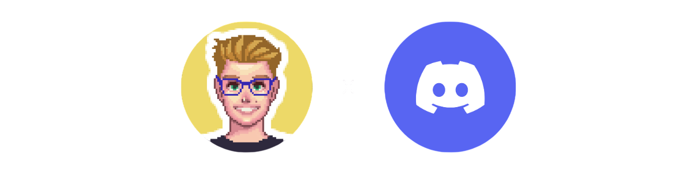

<div align="center">
    
</div>
<p align="center">
  <a href="https://github.com/matheusaudibert/newsletter-bot/stargazers">
    
  </a>
  <a href="https://newsletterbot.audibert.dev" target="_blank">
    
  </a>
</p>

# Newsletter Bot

Bot para Discord que envia automaticamente as notícias da newsletter do Filipe Deschamps para seu servidor.

## Sobre o Projeto

O Newsletter Bot é uma solução para manter sua comunidade informada sobre tecnologia e programação através do Discord. O bot captura e encaminha automaticamente as edições da [newsletter do Filipe Deschamps](https://filipedeschamps.com.br/newsletter), uma das newsletters de tecnologia mais populares do Brasil, diretamente para o canal configurado no seu servidor Discord.

## Começando

Para adicionar o Newsletter Bot ao seu servidor Discord, clique no botão "adicionar bot" acima ou acesse [newsletterbot.audibert.dev](https://newsletterbot.audibert.dev).

## Usando o Bot

### Comandos Básicos

- `/canal` - Configura o canal onde as notícias da newsletter serão publicadas
- `/cargo` - Define qual cargo será mencionado quando novas edições forem enviadas
- `/menu` - Acessa o painel de configurações do bot

### Exemplos de Uso

Para configurar o canal de envio:

```
/canal #tecnologia
```

Para definir o cargo que será mencionado:

```
/cargo @Entusiastas-Tech
```

Para acessar todas as configurações do bot:

```
/menu
```

## Por que usar o Newsletter Bot?

- **Mantenha-se atualizado**: Receba automaticamente as últimas notícias sobre tecnologia
- **Comunidade engajada**: Gere discussões interessantes baseadas nos conteúdos da newsletter
- **Configuração simples**: Configure uma vez e receba todas as edições automaticamente
- **Sem spam**: Apenas as edições oficiais da newsletter serão encaminhadas

## ⭐ Gostou? Contribua!

- Favorite, Compartilhe, sugira melhorias ou contribua com código/documentação!
